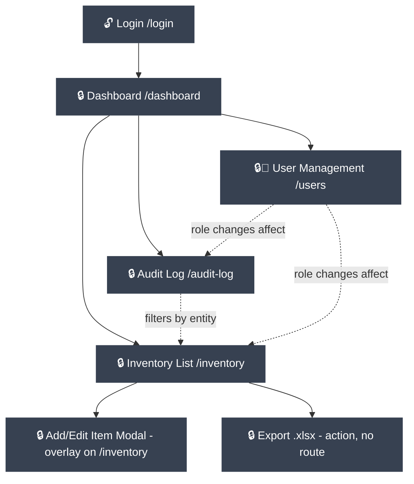

# Feature Inventory

## Information Architecture

**Diagram: Site Map**

🔒 = requires login · 👑 = Editor-only feature within screen (user management is visible to Editors only)

## Features by Module

### Auth Module

| Feature | Description | Roles | Priority | Source |
|---------|-------------|-------|----------|--------|
| Login with email/password | Authenticates user, issues session/JWT | Viewer, Editor | P0 | User-stated |
| Role-aware route guarding | Redirects/blocks based on role on every route | Viewer, Editor | P0 | User-stated |
| Logout | Clears session/token | Viewer, Editor | P0 | Inferred |
| Session expiry / re-auth | Forces re-login after token expiry | Viewer, Editor | P1 | Inferred |

### Dashboard Module

| Feature | Description | Roles | Priority | Source |
|---------|-------------|-------|----------|--------|
| KPI summary cards | Total items, low-stock count, discontinued count, total inventory value | Viewer, Editor | P1 | Inferred |
| Recent activity feed | Last N audit log entries | Viewer, Editor | P1 | Inferred |
| Quick links | Jump to Inventory, Audit Log, Users | Viewer, Editor | P2 | Inferred |

### Inventory Module

| Feature | Description | Roles | Priority | Source |
|---------|-------------|-------|----------|--------|
| Paginated inventory table | Server-paginated list of items | Viewer, Editor | P0 | User-stated |
| Sortable columns | Sort by any column (name, SKU, qty, cost, etc.) | Viewer, Editor | P0 | User-stated |
| Filter by category | Dropdown, multi-select | Viewer, Editor | P0 | User-stated |
| Filter by status | Active / Discontinued toggle or dropdown | Viewer, Editor | P0 | User-stated |
| Filter by quantity range | Min/max numeric inputs | Viewer, Editor | P0 | User-stated |
| Keyword search (name + SKU) | Debounced search input | Viewer, Editor | P0 | User-stated |
| Add new item | Modal form, creates InventoryItem + audit entry | Editor only | P0 | User-stated |
| Inline row edit | Edit fields directly in table row | Editor only | P0 | User-stated |
| Bulk select via checkboxes | Row + "select all" checkboxes | Editor only | P0 | User-stated |
| Bulk delete | Soft-deletes selected items, logs audit entries | Editor only | P0 | User-stated |
| Bulk status update | Sets status (Active/Discontinued) on selected items | Editor only | P0 | User-stated |
| Export current filtered view to .xlsx | Server-generated Excel export respecting active filters/sort | Viewer, Editor | P0 | User-stated |
| Column visibility toggle | Show/hide columns (8 fields = above the 7-column threshold) | Viewer, Editor | P1 | Inferred |
| Low-stock badge/indicator | Visual flag when quantity ≤ reorder threshold | Viewer, Editor | P2 | Inferred |

### Audit Log Module

| Feature | Description | Roles | Priority | Source |
|---------|-------------|-------|----------|--------|
| Audit log table | Timestamp, user, action, entity, before/after diff | Editor only | P0 | User-stated |
| Filter audit log by entity/user/date/action | Narrow down history | Editor only | P1 | Inferred |
| Before/after diff view | Expandable row showing field-level changes | Editor only | P0 | User-stated |
| Export audit log | Consistency with inventory export | Editor only | P2 | Inferred |

### User Management Module

| Feature | Description | Roles | Priority | Source |
|---------|-------------|-------|----------|--------|
| List users | Table of all accounts with role, status, last login | Editor only | P0 | Inferred (required to support role assignment) |
| Invite/create user | Add new Viewer or Editor account | Editor only | P0 | Inferred |
| Change user role | Promote/demote Viewer ↔ Editor | Editor only | P0 | Inferred |
| Deactivate user | Disable login without deleting record | Editor only | P1 | Inferred |
| Reset password (admin-triggered) | Force password reset for a user | Editor only | P2 | Inferred |

## Docs Reconciliation
N/A — Mode 0 (no existing docs/product to reconcile against).
