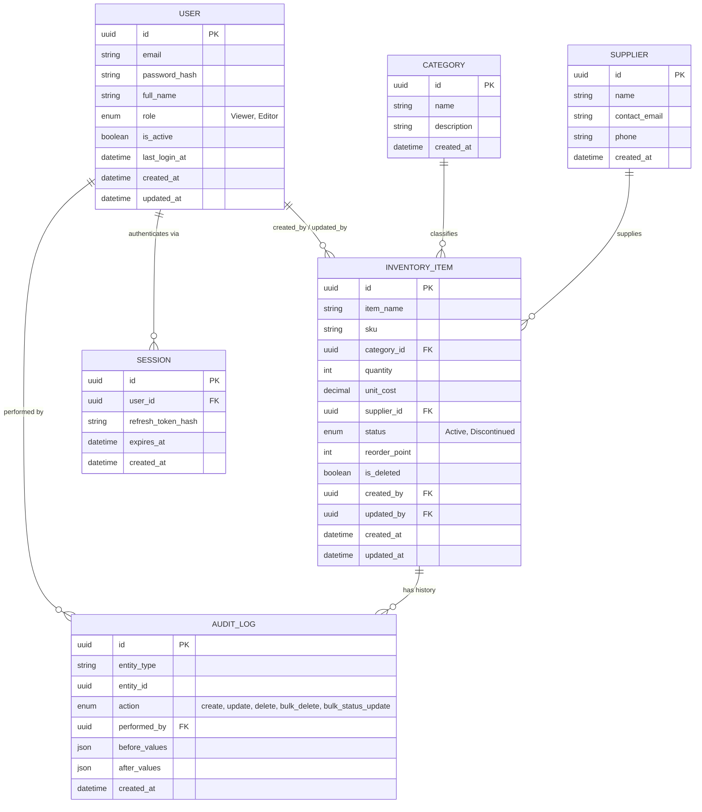
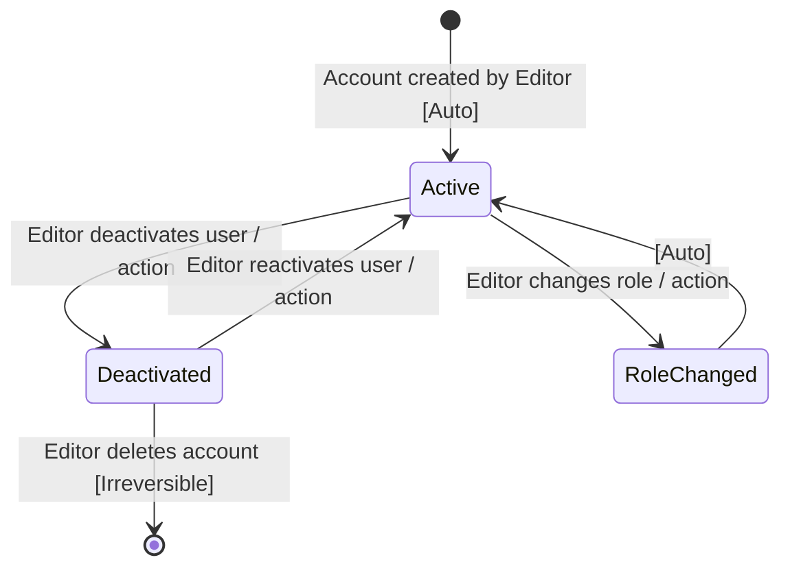
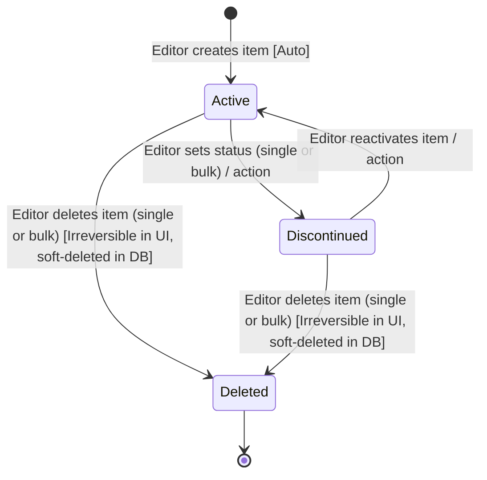

# Data Model

## Entity Relationship Diagram

## Entity Specifications

### User
**Description:** An authenticated account with a fixed role controlling access to inventory data and admin functions.
**Source:** [User-stated] (roles) + [Inferred] (fields required to support login/audit attribution)
**Discovered from:** Login screen requirement, "who made the change" requirement in audit log, role enforcement requirement.

#### Fields
| Field | Type | Required | Constraints | Default | Source |
|-------|------|----------|-------------|---------|--------|
| id | uuid | Yes | PK, auto-generated | — | Inferred |
| email | string | Yes | unique, valid email format | — | Inferred |
| password_hash | string | Yes | bcrypt hash, never returned in API responses | — | Inferred |
| full_name | string | Yes | 1–100 chars | — | Inferred |
| role | enum | Yes | `Viewer` \| `Editor` | `Viewer` | User-stated |
| is_active | boolean | Yes | — | `true` | Inferred |
| last_login_at | datetime | No | nullable | null | Inferred |
| created_at | datetime | Yes | auto-set | now() | Inferred |
| updated_at | datetime | Yes | auto-updated | now() | Inferred |

#### Enum Fields
- `role`: `Viewer` | `Editor`

#### Relationships
- User → 1:N → InventoryItem: as `created_by` / `updated_by`
- User → 1:N → AuditLog: as `performed_by`
- User → 1:N → Session: one user may have multiple active sessions/devices

#### Lifecycle / State Machine — User

#### Audit / Metadata
- created_at, updated_at: Yes
- Soft delete: `is_active = false` acts as soft-deactivation; hard delete of a User is an irreversible admin action.

---

### Session
**Description:** Represents an active login session, used to support refresh-token based JWT auth and "logout everywhere" capability.
**Source:** [Inferred] — required to implement login-based auth with role enforcement.
**Discovered from:** "Login-based authentication" + "Role enforcement on all routes" requirements.

#### Fields
| Field | Type | Required | Constraints | Default | Source |
|-------|------|----------|-------------|---------|--------|
| id | uuid | Yes | PK | — | Inferred |
| user_id | uuid | Yes | FK → User | — | Inferred |
| refresh_token_hash | string | Yes | hashed, never stored in plaintext | — | Inferred |
| expires_at | datetime | Yes | — | now()+7d | Assumed |
| created_at | datetime | Yes | auto-set | now() | Inferred |

#### Relationships
- Session → N:1 → User

#### Audit / Metadata
- Soft delete: not applicable; expired/revoked sessions are hard-deleted or filtered by `expires_at`.

---

### Category
**Description:** A normalized classification for inventory items (e.g. Electronics, Office Supplies, Raw Materials), enabling reliable category-based filtering rather than free-text values that could drift/duplicate.
**Source:** [Inferred] — the spec names "category" as a filterable field; a lookup table ensures consistent filter values.
**Discovered from:** "Filter by category" requirement + "category" field in inventory table.

#### Fields
| Field | Type | Required | Constraints | Default | Source |
|-------|------|----------|-------------|---------|--------|
| id | uuid | Yes | PK | — | Inferred |
| name | string | Yes | unique, 1–60 chars | — | Inferred |
| description | string | No | nullable | null | Inferred |
| created_at | datetime | Yes | auto-set | now() | Inferred |

#### Relationships
- Category → 1:N → InventoryItem

#### Audit / Metadata
- Soft delete: Not required — categories are managed data, deletion blocked while items reference it (FK restrict) `[Assumed]`.

---

### Supplier
**Description:** A vendor/supplier that provides inventory items, used for sourcing and supplier-based reporting.
**Source:** [Inferred] — the spec names "supplier" as an inventory field.
**Discovered from:** "supplier" field in inventory table requirement.

#### Fields
| Field | Type | Required | Constraints | Default | Source |
|-------|------|----------|-------------|---------|--------|
| id | uuid | Yes | PK | — | Inferred |
| name | string | Yes | unique, 1–100 chars | — | Inferred |
| contact_email | string | No | valid email format if present | null | Inferred |
| phone | string | No | — | null | Inferred |
| created_at | datetime | Yes | auto-set | now() | Inferred |

#### Relationships
- Supplier → 1:N → InventoryItem

#### Audit / Metadata
- Soft delete: Not required; deletion blocked while items reference it (FK restrict) `[Assumed]`.

---

### InventoryItem
**Description:** The core entity of the system — a single stock-keeping unit (SKU) tracked for quantity, cost, category, supplier, and lifecycle status.
**Source:** [User-stated] — fields explicitly listed in spec (item name, SKU, category, quantity, unit cost, supplier, status).
**Discovered from:** Main inventory table requirement.

#### Fields
| Field | Type | Required | Constraints | Default | Source |
|-------|------|----------|-------------|---------|--------|
| id | uuid | Yes | PK | — | Inferred |
| item_name | string | Yes | 1–150 chars | — | User-stated |
| sku | string | Yes | unique, alphanumeric, 1–50 chars | — | User-stated |
| category_id | uuid | Yes | FK → Category | — | User-stated (field) / Inferred (normalization) |
| quantity | int | Yes | ≥ 0 | 0 | User-stated |
| unit_cost | decimal(10,2) | Yes | ≥ 0 | 0.00 | User-stated |
| supplier_id | uuid | Yes | FK → Supplier | — | User-stated (field) / Inferred (normalization) |
| status | enum | Yes | `Active` \| `Discontinued` | `Active` | User-stated |
| reorder_point | int | No | ≥ 0, nullable | 10 | Inferred (needed for low-stock indicator) |
| is_deleted | boolean | Yes | soft-delete flag | `false` | Assumed |
| created_by | uuid | Yes | FK → User | — | Inferred |
| updated_by | uuid | Yes | FK → User | — | Inferred |
| created_at | datetime | Yes | auto-set | now() | Inferred |
| updated_at | datetime | Yes | auto-updated | now() | Inferred |

#### Enum Fields
- `status`: `Active` | `Discontinued`

#### Relationships
- InventoryItem → N:1 → Category
- InventoryItem → N:1 → Supplier
- InventoryItem → N:1 → User (created_by, updated_by)
- InventoryItem → 1:N → AuditLog

#### Lifecycle / State Machine — InventoryItem (status)

Guard: only `role = Editor` may trigger any transition. All transitions write an AuditLog entry `[Auto]`.

#### Computed / Derived Fields
| Field | Computed from | Logic |
|-------|-------------|-------|
| total_value | quantity × unit_cost | Displayed in dashboard KPI, not stored |
| is_low_stock | quantity ≤ reorder_point | Drives low-stock badge in table |

#### Audit / Metadata
- created_at, updated_at, created_by, updated_by: Yes — all visible in item detail
- Soft delete: Yes — `is_deleted` flag; bulk delete and single delete both soft-delete to preserve audit trail integrity (see 12-open-questions.md#2)

---

### AuditLog
**Description:** An immutable record of every create/update/delete action on InventoryItem (and User) records, capturing who did what, before/after field values, and when.
**Source:** [User-stated] — "Every create/update/delete records: who made the change, what changed (before/after values), when."
**Discovered from:** Audit Log module requirement.

#### Fields
| Field | Type | Required | Constraints | Default | Source |
|-------|------|----------|-------------|---------|--------|
| id | uuid | Yes | PK | — | Inferred |
| entity_type | string | Yes | e.g. `InventoryItem`, `User` | — | Inferred |
| entity_id | uuid | Yes | ID of the affected record | — | User-stated |
| action | enum | Yes | `create`\|`update`\|`delete`\|`bulk_delete`\|`bulk_status_update` | — | User-stated |
| performed_by | uuid | Yes | FK → User | — | User-stated |
| before_values | json | No | null on `create` | null | User-stated |
| after_values | json | No | null on `delete` | null | User-stated |
| created_at | datetime | Yes | auto-set, immutable | now() | User-stated |

#### Relationships
- AuditLog → N:1 → User (performed_by)
- AuditLog → N:1 → InventoryItem (entity_id, when entity_type = InventoryItem)

#### Lifecycle / State Machine
Not applicable — AuditLog records are write-once, immutable, never updated or deleted (append-only table). This is a deliberate constraint, not a gap.

#### Audit / Metadata
- created_at: Yes (the record's own creation time is the event time)
- Soft delete: No — audit records must never be deletable, including by Editors, to preserve integrity of the trail. `[Assumed — recommend enforcing at DB permission level]`

## Inferred Entities

| Entity | Why inferred | Evidence | Confidence |
|--------|-------------|----------|-----------|
| Category | "Filter by category" implies a finite, consistent set of values | Filter + table field requirement | High |
| Supplier | "supplier" field on items, useful for supplier-based reporting later | Table field requirement | High |
| Session | Login-based auth needs session/token persistence for role enforcement | Auth requirement | High |

## Relationship Summary Table

| From | To | Type | Via | Description |
|------|----|----|-----|-------------|
| User | InventoryItem | 1:N | created_by / updated_by FK | User creates/edits many items |
| User | AuditLog | 1:N | performed_by FK | User performs many audited actions |
| User | Session | 1:N | user_id FK | User has multiple sessions/devices |
| Category | InventoryItem | 1:N | category_id FK | Category groups many items |
| Supplier | InventoryItem | 1:N | supplier_id FK | Supplier supplies many items |
| InventoryItem | AuditLog | 1:N | entity_id (polymorphic) | Item has many audit entries over its lifetime |
