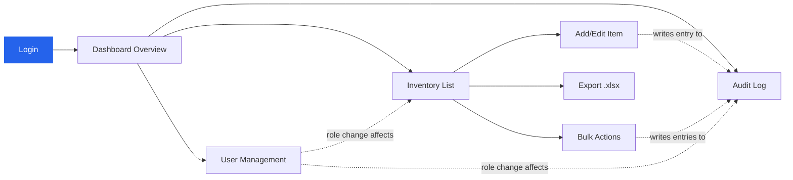
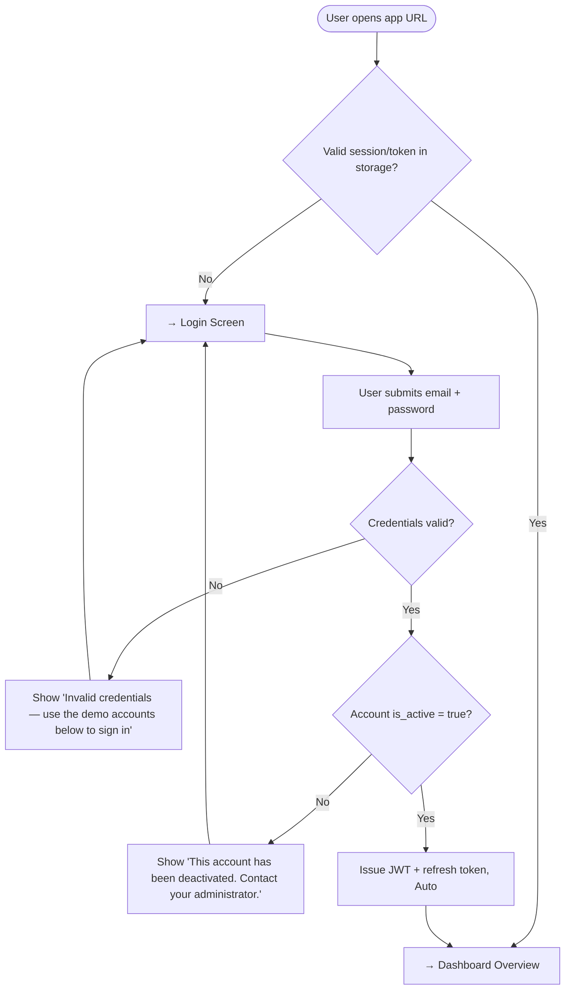
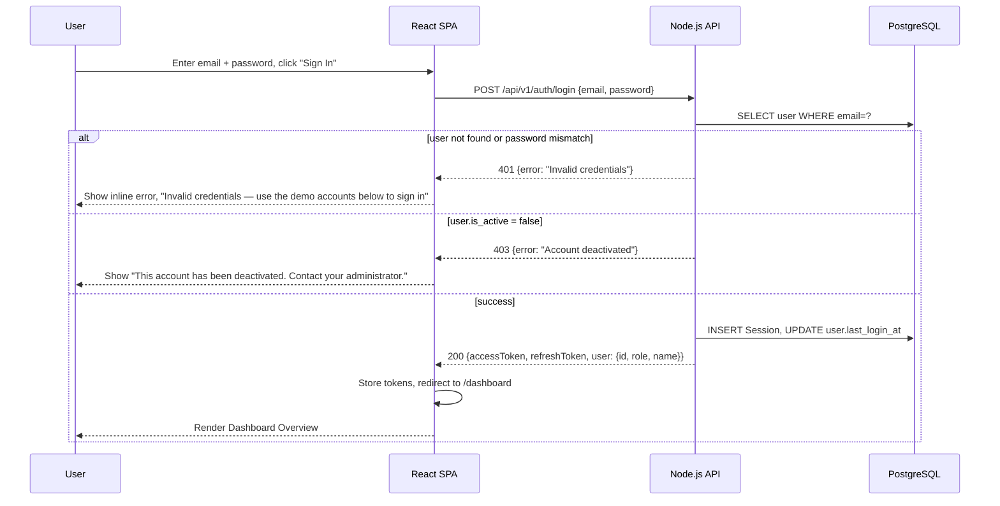
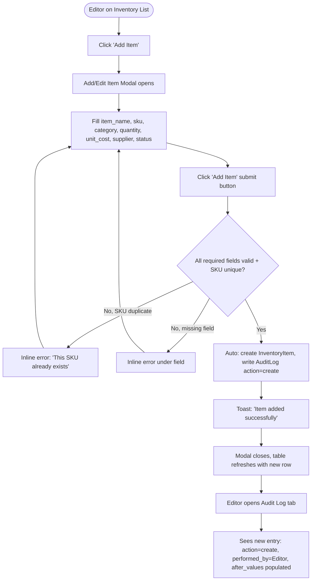
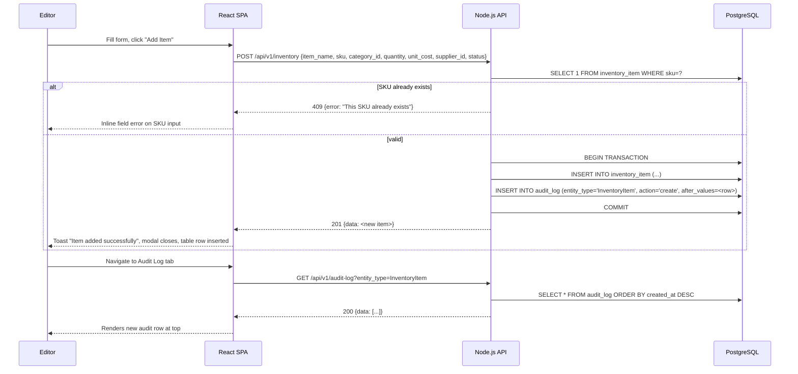
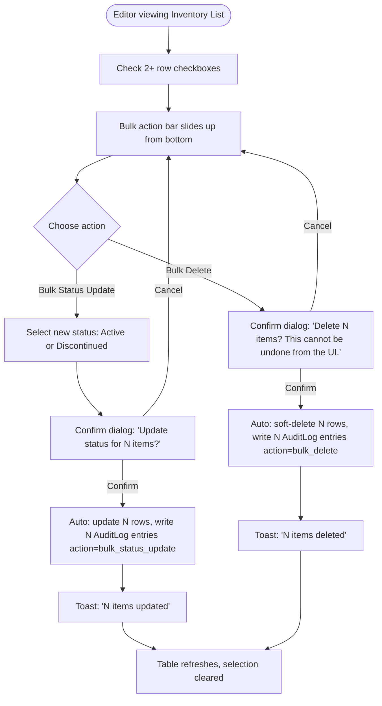
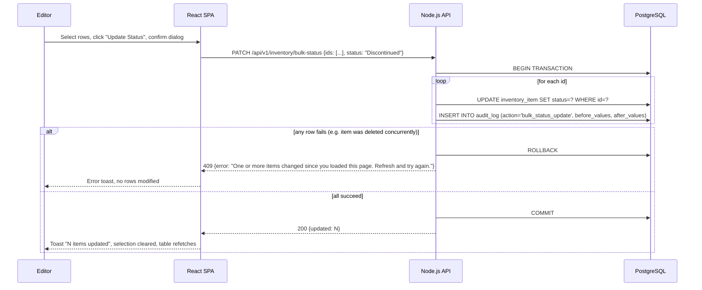
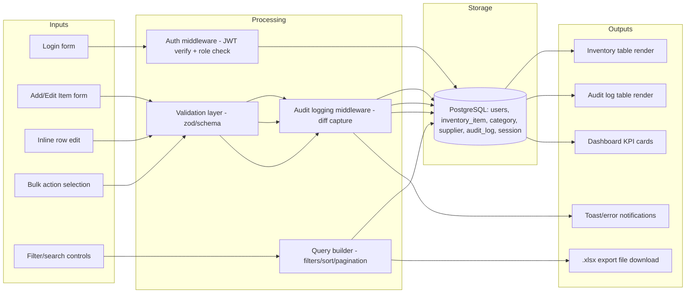

# User Flows — Cross-Screen Journeys

## Master Journey Map

---

## Cross-Screen Flows

### Flow: First Login → Landing on Dashboard

**Actor:** Viewer or Editor
**Trigger:** User navigates to the app URL
**Preconditions:** User has a valid account provisioned by an Editor
**Screens involved:** Login → Dashboard Overview

#### User Flow Diagram

#### Sequence Diagram

#### Step-by-Step

| Step | Screen | Actor action | System response | Error handling |
|------|--------|-------------|-----------------|----------------|
| 1 | Login | Enters email + password | Client-side validation (format) | Empty/invalid format → inline field error |
| 2 | Login | Clicks "Sign In" | POST /api/v1/auth/login | Network failure → toast "Failed to sign in. Check your connection and try again." |
| 3 | Login | — | Server validates credentials + active flag | Wrong creds → 401; inactive account → 403 |
| 4 | Dashboard | Lands on dashboard | GET /api/v1/dashboard/summary | Failure → error banner, retry button |

---

### Flow: Editor Adds a New Item, Reviews It in Audit Log

**Actor:** Editor
**Trigger:** Clicks "Add Item" on Inventory List
**Preconditions:** Logged in as Editor
**Screens involved:** Inventory List → Add/Edit Item Modal → (implicitly) Audit Log

#### User Flow Diagram

#### Sequence Diagram

#### Step-by-Step

| Step | Screen | Actor action | System response | Error handling |
|------|--------|-------------|-----------------|----------------|
| 1 | Inventory List | Click "Add Item" | Opens modal | — |
| 2 | Add/Edit Modal | Fill fields, submit | POST /api/v1/inventory | Duplicate SKU → 409 inline error; missing required field → client + server validation error |
| 3 | Inventory List | Modal closes | Table refetches page 1 with new item visible (or highlights if on current page) | API failure after submit → toast "Item was created but the list failed to refresh — reload the page" |
| 4 | Audit Log | Opens tab | GET /api/v1/audit-log | Failure → error banner with retry |

---

### Flow: Editor Bulk-Selects Items and Bulk-Updates Status

**Actor:** Editor
**Trigger:** Selects 2+ row checkboxes on Inventory List
**Preconditions:** Logged in as Editor, at least one item visible in current filtered view
**Screens involved:** Inventory List only (bulk action bar is inline)

#### User Flow Diagram

#### Sequence Diagram

#### Step-by-Step

| Step | Screen | Actor action | System response | Error handling |
|------|--------|-------------|-----------------|----------------|
| 1 | Inventory List | Check row checkboxes | Bulk action bar appears with count | — |
| 2 | Inventory List | Click "Update Status" / "Delete" | Confirm modal with exact count and consequence | Cancel → dialog closes, no change |
| 3 | Inventory List | Confirm | PATCH/DELETE bulk endpoint, transactional | Partial failure → full rollback, error toast, nothing applied (atomic) |
| 4 | Inventory List | — | Toast + table refresh + selection cleared | — |

---

## Data Flow

