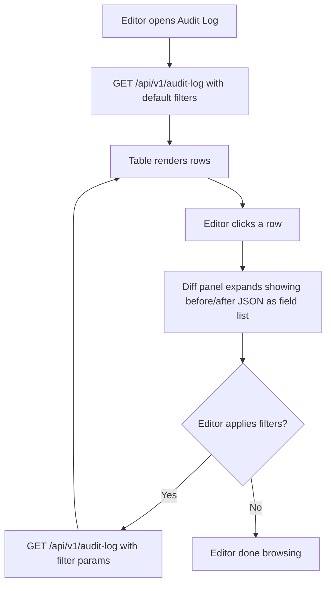
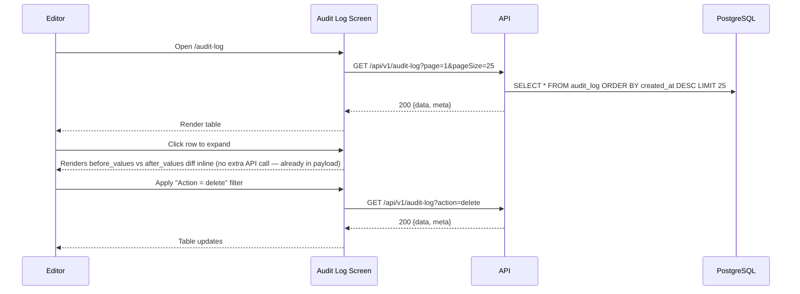

# Audit Log

**Route:** `/audit-log`
**Auth:** Login required — Editor only
**Purpose:** Answer "who changed what, and when" for every inventory mutation — the accountability record.

## Domain Intelligence Analysis (applied)
- **Core entity:** AuditLog — complete attribute set as columns: timestamp, user, action, entity, summary, expand-for-diff.
- **Density target:** Filterable table (no bulk actions — audit log is read-only/immutable by design) + expandable before/after diff row.
- **Anti-generic mandate:** Diff view must show actual field-level before/after values, not a generic "changed" label.

## Navigation Context
**Active nav item:** "Audit Log"
**Breadcrumb path:** None (top-level screen, Editor-only nav item)
**Back navigation:** None
**Tabs on this screen:** None

## UI Component Hierarchy

```
[Audit Log Root]
├── [AppLayout — Sidebar + Topbar]
└── [Main Content Area]
    ├── [Page Header]
    │   ├── Title: "Audit Log"
    │   └── Subtitle: "{totalCount} recorded changes"
    ├── [Filter Toolbar]
    │   ├── Entity type filter (All / Inventory Item / User)
    │   ├── Action filter (All / Create / Update / Delete / Bulk Delete / Bulk Status Update)
    │   ├── User filter (select from Users)
    │   └── Date range picker
    ├── [Audit Table]
    │   ├── Header row (sticky): Timestamp | User | Action | Entity | Summary | Expand
    │   └── Body rows
    │       └── [Expandable Diff Panel] (click row or "Expand" icon)
    │           ├── Before column (red-tinted removed values)
    │           └── After column (green-tinted added/changed values)
    └── [Pagination Bar]
```

## CTA Buttons & Actions
| Label | Variant | Location | Visible to roles | Disabled when | Loading behavior | Confirm dialog? |
|---|---|---|---|---|---|---|
| Row expand icon | icon button | end of each row | Editor only | — | — | No |
| "Clear filters" | ghost | filter toolbar | Editor only | no active filters (hidden) | — | No |

## Components

| Component | What it shows | Interactions | States |
|-----------|--------------|--------------|--------|
| Entity type filter | All / InventoryItem / User | Select | default |
| Action filter | All / create / update / delete / bulk_delete / bulk_status_update | Multi-select | default |
| User filter | List of Users who have performed actions | Select | default |
| Date range picker | Start/end date | Pick dates | default |
| Audit row | timestamp, actor name, action badge, entity name+link, one-line summary | Click → expands diff panel | collapsed / expanded |
| Diff panel | Field-by-field before (red strike) vs after (green) values | — | shown only when expanded |
| Action badge | Colored pill: green=create, blue=update, red=delete/bulk_delete, amber=bulk_status_update | — | default |

## User Flows On This Screen

### View Change History for an Item

**Trigger:** Editor navigates from Inventory List row or dashboard activity feed, or browses directly





| Step | Actor action | System response | Error handling |
|------|-------------|-----------------|----------------|
| 1 | Open Audit Log | GET /api/v1/audit-log | Failure → error banner + retry |
| 2 | Click row | Expands diff panel client-side (data already loaded) | — |
| 3 | Apply filter | Refetch with query params | Failure → toast "Failed to apply filter. Try again." |

**Success:** Table and diff panel render correctly; filters narrow results instantly.
**Errors:** Load failure → page-level error banner with retry; no results → empty state.

## Forms
None (filter controls only, not a submission form).

## API Calls

| Trigger | Method | Endpoint | Request payload | Response | Error handling | User-facing error message |
|---------|--------|----------|----------------|----------|----------------|--------------------------|
| Page load / filter change | GET | /api/v1/audit-log | query: `page,pageSize,entityType,action,userId,dateFrom,dateTo` | `{data: AuditLog[], meta}` | Retry button | "Failed to load audit log. Check your connection and try again." |

## States
**Empty:** No entries match filters → "No changes match these filters." + "Clear filters" CTA. No entries exist at all (brand-new system) → "No changes recorded yet. Actions on inventory items will appear here."
**Loading:** Skeleton table rows matching the 6-column layout.
**Error:** Page-level error alert div: "Failed to load audit log. Check your connection and try again." + "Retry" button.
**Permission-denied:** Viewers cannot reach this route — sidebar nav item is not rendered for Viewer role, and direct navigation to `/audit-log` redirects to `/dashboard` with a toast: "You don't have permission to view the audit log."
