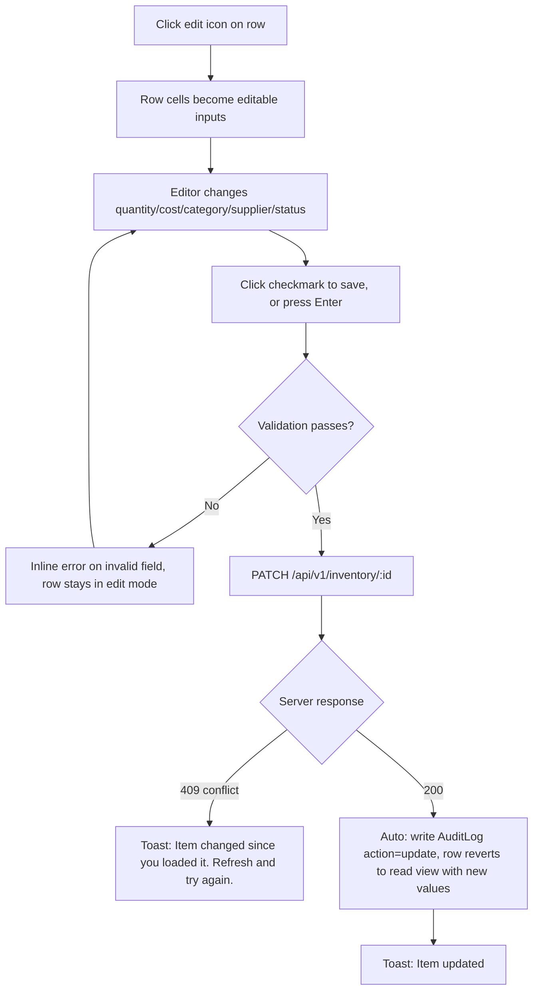
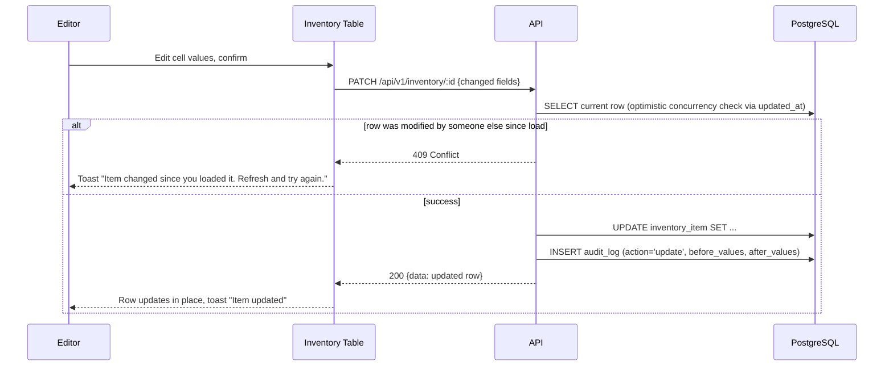
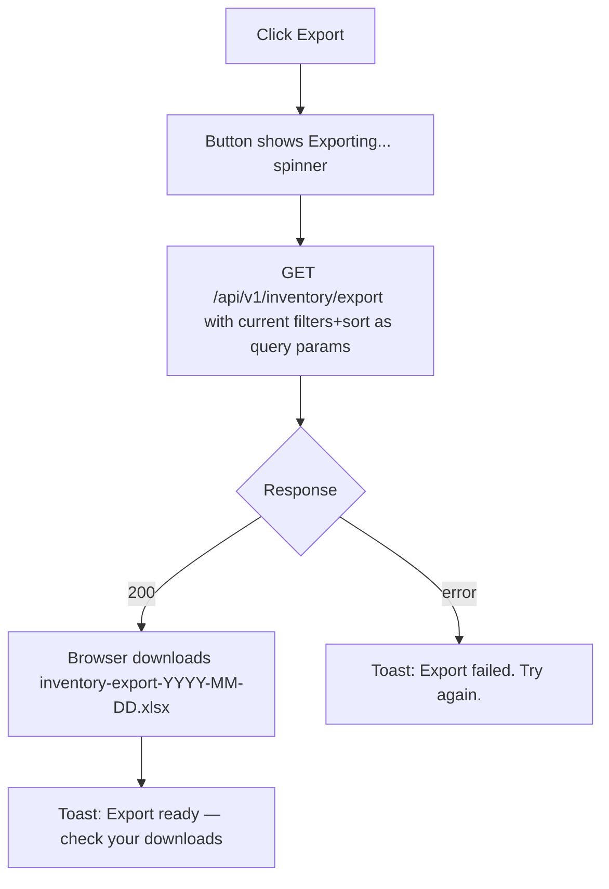
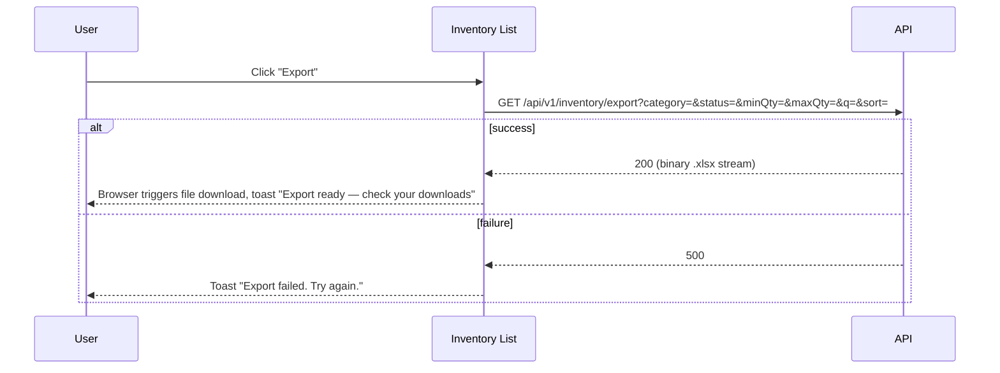

# Inventory List

**Route:** `/inventory`
**Auth:** Login required — Viewer, Editor (mutating actions Editor only)
**Purpose:** The system of record — view, find, and (for Editors) manage every inventory item.

## Domain Intelligence Analysis (applied)
- **Core entity:** InventoryItem — complete attribute set surfaced as columns: checkbox, item_name, sku, category, quantity, unit_cost, supplier, status, updated_at, actions.
- **Column density mandate:** 10 columns (including checkbox + actions) → column visibility toggle required (7+ threshold).
- **Density target:** Full table + filter toolbar + bulk action bar (conditional) + rich pagination.
- **Anti-generic mandate:** No generic "Name/Email/Status/Date" columns — must show item_name, sku, category, quantity, unit_cost, supplier, status specifically.

## Navigation Context
**Active nav item:** "Inventory"
**Breadcrumb path:** None (top-level screen)
**Back navigation:** None
**Tabs on this screen:** None (Audit Log is a separate screen, not a tab of this screen, per screen index — though dashboard/sidebar link between them)

## UI Component Hierarchy

```
[Inventory List Root]
├── [AppLayout — Sidebar + Topbar]
└── [Main Content Area]
    ├── [Page Header]
    │   ├── Title: "Inventory"
    │   ├── Subtitle: "{totalCount} items"
    │   └── CTA Group (top-right)
    │       ├── "Export" — ghost, icon: Download
    │       └── "Add Item" — primary — Editor only
    ├── [Filter/Toolbar Row]
    │   ├── Search input (name + SKU) — debounced 300ms
    │   ├── Category multi-select dropdown
    │   ├── Status dropdown (All / Active / Discontinued)
    │   ├── Quantity range (min/max numeric inputs)
    │   ├── "Clear filters" ghost button (visible when any filter active)
    │   └── Column visibility toggle (dropdown checklist)
    ├── [Bulk Action Bar] (slides up from bottom when rows selected — Editor only)
    │   ├── "{N} selected"
    │   ├── "Update Status" dropdown button
    │   ├── "Delete" destructive button
    │   └── "Clear selection" ghost button
    ├── [Data Table]
    │   ├── Header row (sticky) — sortable column headers with directional arrows
    │   │   ├── [checkbox — select all] (Editor only column)
    │   │   ├── Item Name
    │   │   ├── SKU
    │   │   ├── Category
    │   │   ├── Quantity (with low-stock badge if ≤ reorder_point)
    │   │   ├── Unit Cost
    │   │   ├── Supplier
    │   │   ├── Status (colored badge)
    │   │   ├── Last Updated
    │   │   └── Actions (Editor only: edit icon, delete icon)
    │   └── Body rows (striped, hover highlight)
    │       └── Inline-editable cells (Editor only, click-to-edit: quantity, unit_cost, status, category, supplier)
    └── [Pagination Bar]
        ├── Page numbers
        ├── Items-per-page select (25/50/100)
        └── "Showing X–Y of Z items"
```

## CTA Buttons & Actions
| Label | Variant | Location | Visible to roles | Disabled when | Loading behavior | Confirm dialog? |
|---|---|---|---|---|---|---|
| "Add Item" | primary | top-right page header | Editor only | — | spinner in modal submit | No |
| "Export" | ghost, icon | top-right page header | Viewer, Editor | no rows match current filter | button → "Exporting…" spinner | No |
| "Update Status" | secondary dropdown | bulk action bar | Editor only (bar hidden for Viewer) | no rows selected (bar not shown) | — | Yes — "Update status for {N} items to {status}?" |
| "Delete" | destructive | bulk action bar | Editor only | no rows selected (bar not shown) | — | Yes — "Delete {N} items? This cannot be undone from the UI." |
| Row edit icon | icon button | row actions column, visible on hover | Editor only | — | — | No — enables inline edit mode on row |
| Row delete icon | icon button | row actions column, visible on hover | Editor only | — | — | Yes — "Delete '{item_name}'? This cannot be undone from the UI." |
| "Clear filters" | ghost | filter toolbar | Viewer, Editor | no active filters (hidden) | — | No |

## Components

| Component | What it shows | Interactions | States |
|-----------|--------------|--------------|--------|
| Search input | Keyword matching name+SKU | Type (debounced), clear (x) | default / active / empty results |
| Category filter | Multi-select of Category entities | Toggle checkboxes | default / N selected badge |
| Status filter | All / Active / Discontinued | Select | default |
| Quantity range | Min / Max numeric inputs | Type, blur-applies | default / invalid (min > max) |
| Column visibility toggle | Checklist of all 8 data columns | Toggle show/hide | default |
| Status badge (in-row) | "Active" (green tint) / "Discontinued" (gray tint) | Editor: click → inline dropdown to change | default / editing |
| Low-stock badge | Amber "Low Stock" pill next to quantity when qty ≤ reorder_point | — | conditional visibility |
| Bulk action bar | Selection count + actions | Slides up/down with transition | hidden / visible |

## User Flows On This Screen

### Inline Edit Row

**Trigger:** Click row edit icon (or click directly into an editable cell)





| Step | Actor action | System response | Error handling |
|------|-------------|-----------------|----------------|
| 1 | Click edit icon | Row becomes editable | — |
| 2 | Edit field(s), confirm | Client validation | Invalid quantity (negative) → inline error "Quantity cannot be negative" |
| 3 | — | PATCH request | 409 conflict → toast + row reverts to last-known server state |
| 4 | — | Success | Toast "Item updated", row shows new values, audit entry created |

**Success:** Row returns to read mode with updated values; toast "Item updated".
**Errors:** Validation errors inline per field; conflict (concurrent edit) → toast with guidance to refresh; network failure → toast "Failed to save changes. Try again."

### Add Item — see `add-edit-item-modal.md`
### Bulk Delete / Bulk Status Update — see `05-user-flows.md` ("Editor Bulk-Selects Items and Bulk-Updates Status")

### Export Filtered View

**Trigger:** Click "Export"





| Step | Actor action | System response | Error handling |
|------|-------------|-----------------|----------------|
| 1 | Click "Export" | Button enters loading state | Disabled if 0 rows match filter |
| 2 | — | Server builds .xlsx from current filtered/sorted query | 5xx → toast "Export failed. Try again." |
| 3 | — | Browser downloads file | — |

## Forms
Inline-edit fields are not a discrete form screen — see Components table above for per-field validation. Add/Edit modal form is documented in `add-edit-item-modal.md`.

## API Calls

| Trigger | Method | Endpoint | Request payload | Response | Error handling | User-facing error message |
|---------|--------|----------|----------------|----------|----------------|--------------------------|
| Page load / filter change | GET | /api/v1/inventory | query: `page,pageSize,sort,category,status,minQty,maxQty,q` | `{data: Item[], meta: {totalCount,page,pageSize}}` | Retry button | "Failed to load inventory. Check your connection and try again." |
| Inline edit save | PATCH | /api/v1/inventory/:id | changed fields | updated item | 409 → toast; validation → inline | "Item changed since you loaded it. Refresh and try again." |
| Row delete | DELETE | /api/v1/inventory/:id | — | `{success:true}` | 404 → toast | "This item was already deleted." |
| Bulk status update | PATCH | /api/v1/inventory/bulk-status | `{ids[], status}` | `{updated:N}` | 409 → full rollback | "One or more items changed since you loaded this page. Refresh and try again." |
| Bulk delete | DELETE | /api/v1/inventory/bulk | `{ids[]}` | `{deleted:N}` | 409 → full rollback | Same as above |
| Export | GET | /api/v1/inventory/export | same filters as list | binary .xlsx | 5xx → toast | "Export failed. Try again." |

## States
**Empty:** No items match filters → "No items match your filters." + "Clear filters" CTA. No items exist at all (fresh install) → "No inventory items yet. Add your first item to get started." + "Add Item" CTA (Editor only).
**Loading:** Skeleton table rows matching the full 8-column width, skeleton toolbar.
**Error:** Error alert div at top of table area: "Failed to load inventory. Check your connection and try again." + "Retry" button.
**Permission-denied:** Viewer sees the identical table but with no checkbox column, no "Add Item" CTA, no row action icons, and status/quantity/etc. cells are plain text (not click-to-edit).
