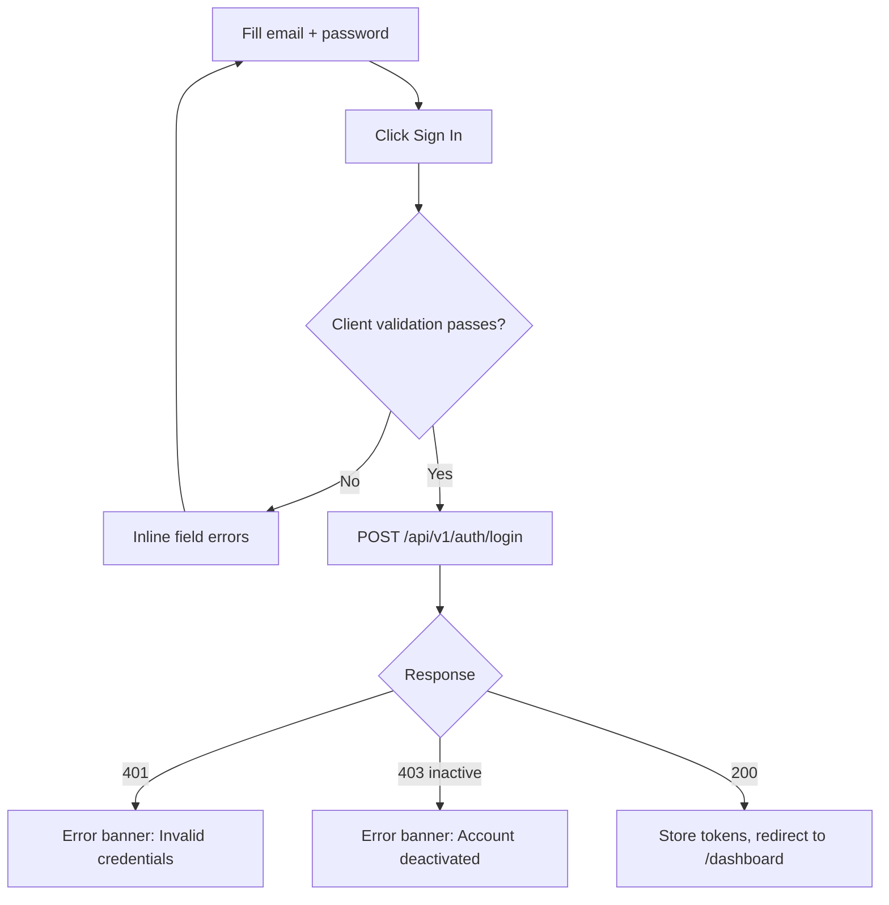
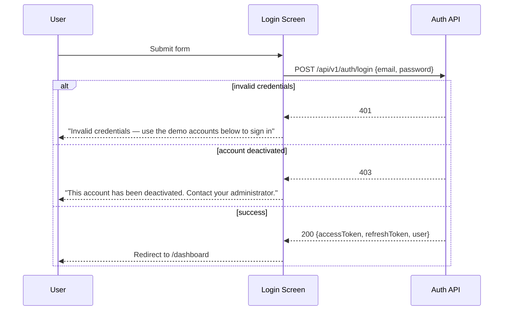

# Login

**Route:** `/login`
**Auth:** Public
**Purpose:** Authenticate a user and route them into the app based on their role.

## Domain Intelligence Analysis (applied)
- **Industry:** Internal business tooling (inventory admin)
- **Trust threshold:** Low — internal tool, no external social proof needed
- **Theme:** Light (B2B internal admin tool, professional context)
- **OAuth:** None — spec defines login-based auth only, no third-party providers
- **Mock credentials (multi-role):**
```
<credentials>
  Role: Viewer    Email: viewer@northgate-inventory.com    Password: ViewInv#2026
  Role: Editor    Email: editor@northgate-inventory.com    Password: EditInv#2026
</credentials>
```

## Navigation Context
**Active nav item:** None — auth screens have no sidebar/topnav (full-viewport layout)
**Breadcrumb path:** None
**Back navigation:** None
**Tabs on this screen:** None

## UI Component Hierarchy

```
[Login Screen Root — full viewport, no AppLayout]
├── [Brand Panel] (left 50%, hidden on <768px)
│   ├── Logo + App Name: "InvenTrack Admin"
│   ├── Tagline: "One source of truth for stock, cost, and change history."
│   └── Feature highlights (3, outcome-focused)
├── [Form Panel] (right 50%, full width on mobile)
│   ├── Logo (mobile only)
│   ├── Title: "Sign in to InvenTrack"
│   ├── Login Form
│   │   ├── Email input (type=email)
│   │   ├── Password input (type=password, show/hide toggle)
│   │   ├── "Remember me" checkbox
│   │   └── Primary CTA: "Sign In"
│   ├── Demo Credentials Box
│   │   └── Table: Role | Email | "Use" button (autofills form)
│   └── Inline error region (below form, shown on failed auth)
```

## CTA Buttons & Actions
| Label (exact text) | Variant | Location | Visible to roles | Disabled when | Loading behavior | Confirm dialog? |
|---|---|---|---|---|---|---|
| "Sign In" | primary, full-width | Bottom of form | Public | email/password empty or invalid format | spinner replaces label → "Signing in…", button width locked | No |
| "Use" (per credential row) | ghost, small | Demo credentials table row | Public | — | — | No |

## Components

| Component | What it shows | Interactions | States |
|-----------|--------------|--------------|--------|
| Email input | Email address | Type, blur-validate | default / focused / error / disabled (during submit) |
| Password input | Masked password | Type, toggle visibility | default / focused / error / disabled |
| Demo credentials table | Role, email, "Use" button | Click "Use" → autofills form via setValue | default |
| Error banner | "Invalid credentials — use the demo accounts below to sign in" or "This account has been deactivated. Contact your administrator." | — | hidden / visible |

## User Flows On This Screen

### Login

**Trigger:** Click "Sign In"





| Step | Actor action | System response | Error handling |
|------|-------------|-----------------|----------------|
| 1 | Enter email, password | Client-side format validation | Invalid email format → inline error "Enter a valid email address" |
| 2 | Click "Sign In" | POST /api/v1/auth/login | Network failure → toast "Failed to sign in. Check your connection and try again." |
| 3 | — | Redirect on success | 401/403 → error banner per above |

**Success:** Redirect to `/dashboard`, session established.
**Errors:** Invalid credentials → banner + demo credentials highlighted; deactivated account → banner directing to administrator; network failure → toast with retry.

## Forms

### Login Form
| Field | Type | Required | Validation rules | Error message | Placeholder |
|-------|------|----------|------------------|----------------|-------------|
| Email | email | Yes | valid email format | "Enter a valid email address" | "you@company.com" |
| Password | password | Yes | min 8 chars | "Password is required" | "Enter your password" |

**Submit behavior:** POST to `/api/v1/auth/login`; on success, store tokens and redirect.
**Success state:** Immediate redirect — no success message needed on this screen.

## API Calls

| Trigger | Method | Endpoint | Request payload | Response | Error handling | User-facing error message |
|---------|--------|----------|----------------|----------|----------------|--------------------------|
| Click "Sign In" | POST | /api/v1/auth/login | `{email, password}` | `{accessToken, refreshToken, user}` | 401/403 handled inline; 5xx → toast | "Invalid credentials — use the demo accounts below to sign in" / "This account has been deactivated. Contact your administrator." / "Failed to sign in. Check your connection and try again." |

## States
**Empty:** N/A (form starts empty by design; no empty-state pattern applies)
**Loading:** Submit button shows spinner + "Signing in…", inputs disabled
**Error:** Red error banner above the form with the specific message
**Permission-denied:** N/A — this screen is public
