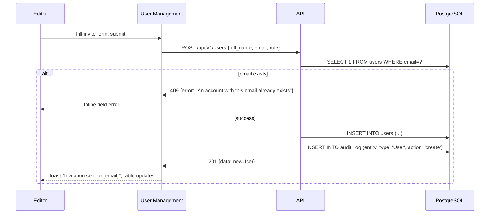
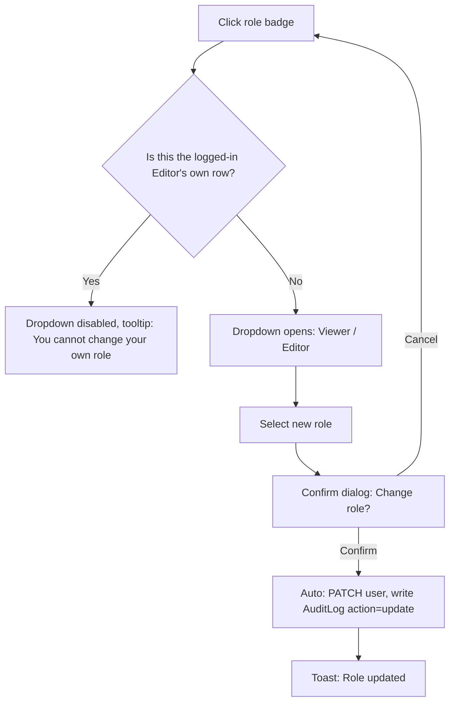
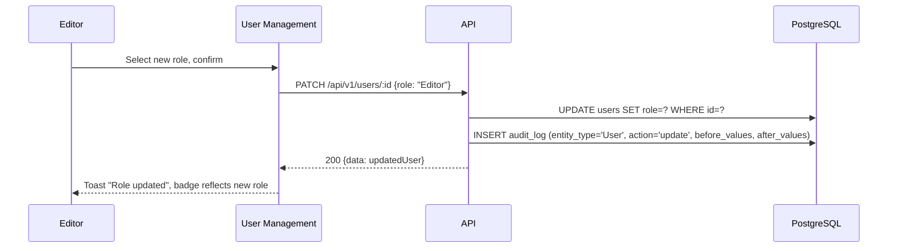

# User Management

**Route:** `/users`
**Auth:** Login required — Editor only
**Purpose:** Provision accounts and control who has Viewer vs Editor access — the access-control surface of the tool.

## Domain Intelligence Analysis (applied)
- **Core entity:** User — columns: name, email, role, status (Active/Deactivated), last login, actions.
- **Density target:** Full table (6 columns, below the 7-column visibility-toggle threshold) + invite/create modal (progressive, ≤3 fields since this is a lightweight provisioning action, not a data-heavy back-office record).
- **Note:** This screen exists to satisfy the "role enforcement" and "who made the change" requirements — someone must assign roles. Per 12-open-questions.md#1, this is currently Editor-owned.

## Navigation Context
**Active nav item:** "Users"
**Breadcrumb path:** None (top-level screen, Editor-only nav item)
**Back navigation:** None
**Tabs on this screen:** None

## UI Component Hierarchy

```
[User Management Root]
├── [AppLayout — Sidebar + Topbar]
└── [Main Content Area]
    ├── [Page Header]
    │   ├── Title: "Users"
    │   ├── Subtitle: "{totalCount} accounts"
    │   └── CTA: "Invite User" — primary, top-right
    ├── [Filter Toolbar]
    │   ├── Search (name/email)
    │   └── Role filter (All / Viewer / Editor)
    ├── [Users Table]
    │   ├── Header row: Name | Email | Role | Status | Last Login | Actions
    │   └── Body rows
    │       ├── Role cell: click → inline dropdown (Viewer/Editor)
    │       ├── Status badge: Active (green) / Deactivated (gray)
    │       └── Actions: "Deactivate"/"Reactivate" icon, "Reset Password" icon
    └── [Pagination Bar]
```

## CTA Buttons & Actions
| Label | Variant | Location | Visible to roles | Disabled when | Loading behavior | Confirm dialog? |
|---|---|---|---|---|---|---|
| "Invite User" | primary | top-right page header | Editor only | — | opens modal | No |
| Role dropdown (inline) | inline select | Role column, per row | Editor only | target row is the currently logged-in Editor's own account (cannot self-demote) | spinner on the badge while saving | Yes — "Change {name}'s role from {old} to {new}?" |
| "Deactivate" / "Reactivate" | icon button | Actions column | Editor only | target is own account (cannot self-deactivate) | — | Yes — "Deactivate {name}? They will be immediately signed out and unable to log in." |
| "Reset Password" | icon button | Actions column | Editor only | — | button → spinner | Yes — "Send password reset to {email}?" |

## Components

| Component | What it shows | Interactions | States |
|-----------|--------------|--------------|--------|
| Users table | 6-column list of all accounts | Sort by name/last login | default / loading / empty |
| Role inline dropdown | Current role as editable badge | Click → dropdown → confirm | default / editing / disabled (self-row) |
| Status badge | Active / Deactivated | — | default |
| Invite User modal | Form: name, email, role | Fill, submit | default / submitting / error |

## User Flows On This Screen

### Invite New User

**Trigger:** Click "Invite User"

```mermaid
flowchart TD
  A[Click Invite User] --> B[Modal opens: Name, Email, Role]
  B --> C[Fill fields, click Send Invite]
  C --> D{Email already exists?}
  D -->|Yes| E[Inline error: An account with this email already exists]
  E --> B
  D -->|No| F[Auto: create User record, role=selected, is_active=true]
  F --> G[Toast: Invitation sent to {email}]
  G --> H[Modal closes, table refreshes with new row]
```



| Step | Actor action | System response | Error handling |
|------|-------------|-----------------|----------------|
| 1 | Click "Invite User" | Modal opens | — |
| 2 | Fill name/email/role, submit | POST /api/v1/users | Duplicate email → inline error; missing field → inline error |
| 3 | — | Success | Toast, modal closes, table row appears |

**Success:** Toast "Invitation sent to {email}"; new row appears in table with status Active.
**Errors:** Duplicate email inline error; network failure → toast "Failed to create user. Try again."

### Change a User's Role

**Trigger:** Click role badge on a row





| Step | Actor action | System response | Error handling |
|------|-------------|-----------------|----------------|
| 1 | Click role badge | Dropdown opens (unless own row) | Own row → disabled with tooltip |
| 2 | Select new role, confirm | PATCH /api/v1/users/:id | 403 (target no longer exists/self-demote race) → toast |
| 3 | — | Success | Toast "Role updated", audit entry created |

**Success:** Badge updates immediately, toast "Role updated".
**Errors:** Attempting to change own role is blocked client-side and server-side (403 "You cannot change your own role").

## Forms

### Invite User Form
| Field | Type | Required | Validation rules | Error message | Placeholder |
|-------|------|----------|------------------|----------------|-------------|
| Full Name | text | Yes | 1–100 chars | "Name is required" | "e.g. Priya Sharma" |
| Email | email | Yes | valid format, unique | "An account with this email already exists" / "Enter a valid email address" | "name@company.com" |
| Role | select | Yes | Viewer or Editor | "Select a role" | "Viewer" (default) |

**Submit behavior:** `POST /api/v1/users` — creates account with a system-generated temporary password and (future) sends an invite email; for this scope, temporary password is shown once in a toast/modal for manual sharing `[Assumed — no email integration in current scope, see 07-integrations.md]`.
**Success state:** Toast confirms creation; table updates with new row.

## API Calls

| Trigger | Method | Endpoint | Request payload | Response | Error handling | User-facing error message |
|---------|--------|----------|----------------|----------|----------------|--------------------------|
| Page load | GET | /api/v1/users | query: `page,pageSize,role,q` | `{data: User[], meta}` | Retry button | "Failed to load users. Check your connection and try again." |
| Invite user | POST | /api/v1/users | `{full_name, email, role}` | created user | 409 duplicate email | "An account with this email already exists" |
| Change role | PATCH | /api/v1/users/:id | `{role}` | updated user | 403 self-demote | "You cannot change your own role" |
| Deactivate/Reactivate | PATCH | /api/v1/users/:id/deactivate | `{is_active}` | updated user | 403 self-deactivate | "You cannot deactivate your own account" |
| Reset password | POST | /api/v1/users/:id/reset-password | — | `{success:true}` | 5xx | "Failed to send password reset. Try again." |

## States
**Empty:** Cannot realistically be empty (the logged-in Editor always exists) — but if filters return nothing: "No users match your filters." + "Clear filters" CTA.
**Loading:** Skeleton table rows matching 6-column layout.
**Error:** Page-level error alert div: "Failed to load users. Check your connection and try again." + "Retry" button.
**Permission-denied:** Viewers cannot reach this route — sidebar nav item not rendered, and direct navigation redirects to `/dashboard` with toast "You don't have permission to manage users."
