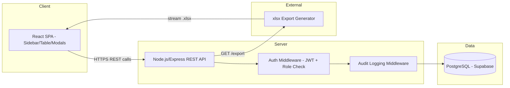

# Technical Architecture — Inventory Admin Tool

> Note: This is a greenfield build. Unlike Mode 1/2 (which document an *existing* product's observed stack), this file documents the **chosen target architecture**, confirmed with the user.

## Confirmed Stack `[User-stated]`

| Layer | Choice | Notes |
|-------|--------|-------|
| Frontend | React | SPA with client-side routing |
| Backend | Node.js | REST API layer |
| Database | PostgreSQL | Hosted on Supabase per original spec |

## Recommended Architecture Detail `[Assumed — verify before building]`

### Frontend
| Layer | Recommendation | Rationale |
|-------|----------------|-----------|
| Framework | React 18 + Vite | Fast dev loop, no SSR needed for an internal admin tool |
| Routing | React Router v6 | Standard SPA routing, role-gated route guards |
| Data fetching | TanStack Query | Caching, pagination, optimistic updates for inline edit |
| Table | TanStack Table (headless) | Sorting, pagination, column visibility needed for dense admin table |
| Forms | react-hook-form + zod | Inline edit + add/edit modal validation |
| UI components | Tailwind CSS + custom component library | Dense admin UI, sticky headers, sidebar nav |
| State | React Query (server state) + minimal local state | No need for global client state library |

### Backend
| Layer | Recommendation | Rationale |
|-------|----------------|-----------|
| Framework | Node.js + Express (or Fastify) | REST API, matches user's stated backend choice |
| ORM | Prisma | Type-safe PostgreSQL access, migration tooling |
| Auth | JWT (access + refresh token) issued by backend; passwords hashed with bcrypt | Login-based auth per spec; Supabase Auth is an acceptable alternative — see open questions |
| Authorization | Middleware role-check on every mutating route | "Role enforcement on all routes" per spec |
| Export | `exceljs` (server-generates .xlsx) | Export must reflect exact filtered/sorted server-side view |
| Audit logging | Write-through logging middleware wrapping all create/update/delete DB calls | Captures before/after diff transactionally with the mutation |

### Data & Infrastructure
| Layer | Recommendation | Rationale |
|-------|----------------|-----------|
| Database | PostgreSQL (Supabase-hosted) | Per spec |
| Migrations | Prisma Migrate | Versioned schema changes |
| Hosting | Any Node-compatible host (Render/Railway/Fly.io) + Supabase for DB | Internal tool, no need for multi-region |
| Environment | `.env` for DB connection string, JWT secret | Never hardcoded |

## Inferred Architecture Diagram

## API Patterns
- Auth: Bearer JWT in `Authorization` header, issued on `/api/auth/login`
- Response format: JSON, `{ data, meta }` envelope for list endpoints (meta = pagination info)
- Pagination: offset-based (`page`, `pageSize`) with `totalCount` in response meta — chosen for simplicity of jump-to-page UI in a dense admin table `[Assumed]`
- Versioning: `/api/v1/` prefix
- Rate limiting: not required for internal tool with small user base `[Assumed]`
